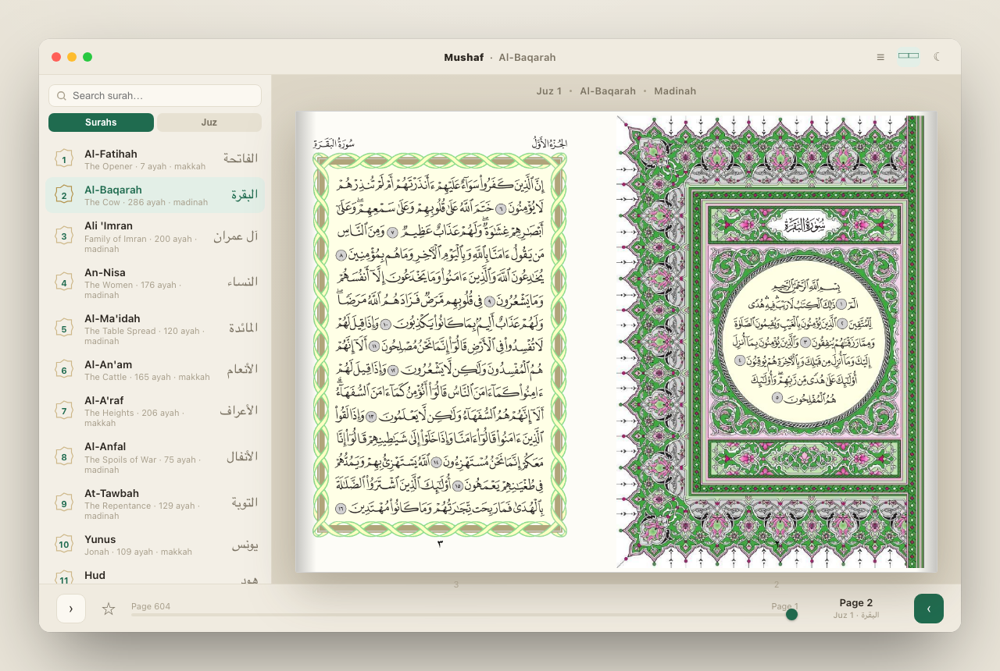

# Mushaf — a simple Quran reader for macOS

A clean, native **SwiftUI** app for reading the Qur'an on your Mac as the **real Mushaf
al-Madinah pages** — the familiar King Fahd Complex printing — shown as a right-to-left
two-page spread, just like holding a physical mushaf.

No accounts, no clutter. Open it and read.



> The image above is a UI preview rendered from the design prototype in [`design/`](design/).

## Features

- 📖 **Real Mushaf al-Madinah pages** — the actual page scans, not re-typeset text.
- 📚 **Two-page spread**, right-to-left, paired as (1,2), (3,4), … like an open mushaf.
- 🧭 **Sidebar navigation** by **Surah** (114), **Juz** (30), or **Hizb** — including all **240 rub-al-hizb quarters** (¼ / ½ / ¾).
- ⭐ **Bookmarks** — star any page; saved pages live in their own ★ tab and persist across launches.
- 🔖 **Remembers your place** — reopens to the last page you were reading.
- 🖱️ **Scroll-wheel paging** and arrow-key navigation (← forward, → back).
- 🖥️ **Distraction-free fullscreen** — chrome hides; just the Qur'an. Controls re-appear on mouse move.
- 🌗 **Light & dark** themes, with a warm parchment palette.
- 📡 **Offline-friendly** — pages are cached to disk as you read, so revisited pages need no network.

## 🤖 Install with your AI agent (copy-paste)

Paste this into Claude Code, Cursor, or any coding agent on your Mac and it will
install the app cleanly end-to-end:

```text
Install the Mushaf macOS Quran reader from https://github.com/skcadri/quran-mac on this Mac:

1. Verify prerequisites: `git --version` and `swift --version` (needs Swift 6+,
   macOS 14+). If swift is missing, run `xcode-select --install`, wait for it to
   finish, then re-check.
2. Clone and build:
     git clone https://github.com/skcadri/quran-mac.git /tmp/quran-mac-install
     cd /tmp/quran-mac-install
     ./build_app.sh
   This produces an ad-hoc-signed Mushaf.app in the repo folder.
3. Install it, replacing any older copy:
     rm -rf /Applications/Mushaf.app
     mv Mushaf.app /Applications/
4. Launch and verify:
     open /Applications/Mushaf.app
   Confirm the process is alive with `pgrep -x Mushaf` and that no crash report
   appears in ~/Library/Logs/DiagnosticReports. The window shows a two-page
   Mushaf spread (internet is needed the first time each page is viewed; pages
   are cached to ~/Library/Application Support/Mushaf/pages for offline reading).
5. Clean up: rm -rf /tmp/quran-mac-install
Only report success after step 4 passes.
```

That's it — the app ends up in `/Applications` like any other Mac app.

## Requirements

- macOS 14 (Sonoma) or later
- Xcode 16+ / Swift 6 toolchain (to build)

## Build & run

```bash
git clone https://github.com/skcadri/quran-mac.git
cd quran-mac

# Quick run (bare window):
swift run

# Or build a proper double-clickable Mushaf.app:
./build_app.sh && open Mushaf.app
```

You can also just `open Package.swift` to work on it in Xcode.

## How it works

- **Pages** are fetched on demand from the Mushaf al-Madinah scan set and cached under
  `~/Library/Application Support/Mushaf/pages/`. The first time you visit a page it
  downloads (~once); after that it's instant and offline. See `Sources/Mushaf/PageStore.swift`.
- **Metadata** (surah names, juz / hizb / rub-al-hizb page boundaries) lives in the
  auto-generated `Sources/Mushaf/QuranData.swift`.
- Architecture and conventions are documented in [`CLAUDE.md`](CLAUDE.md).

### Going fully offline (optional)

`PageStore` already looks for a bundled `Pages/<n>.png` resource folder before hitting the
network. Drop a downscaled set of all 604 pages there and add it to the target's resources
to ship a self-contained, no-network build. (The full-resolution set is ~1.1 GB; downscale
to ~150–250 MB first.)

## Credits

- **Page images:** Mushaf al-Madinah scans from the King Fahd Glorious Qur'an Printing
  Complex, sourced via [sufone/medina-mushaf](https://github.com/sufone/medina-mushaf).
  These are **not** redistributed in this repo — they are fetched at runtime.
- **Surah / juz / hizb metadata:** the [Quran.com API](https://api-docs.quran.foundation/).

## License

Source code: [MIT](LICENSE).

The Qur'an page content is **not** covered by this license and is not bundled here — see the
note in [`LICENSE`](LICENSE). The Qur'an is sacred scripture; please use this tool with adab.
